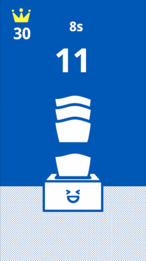
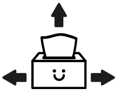
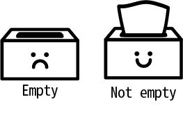
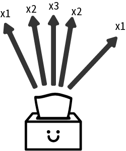

# [TissueBox](https://github.com/yum650350/tissuebox)
A mobile phone game made by Flutter.



    
## Build Info
```
$ flutter --version
Flutter 1.2.1 • channel stable • https://github.com/flutter/flutter.git
Framework • revision 8661d8aecd (6 weeks ago) • 2019-02-14 19:19:53 -0800
Engine • revision 3757390fa4
Tools • Dart 2.1.2 (build 2.1.2-dev.0.0 0a7dcf17eb)
```

## Dependencies
- Packages
	1. [flame](https://pub.dartlang.org/packages/flame)
	2. [shared_preferences](https://pub.dartlang.org/packages/shared_preferences)
- Font
	1. [Noto Sans](https://www.google.com/get/noto/#sans-lgc)
	
## Assets
Assets are all made by yum650350.

- Images
    1. Tissue Box (assets\images\0, 1, 2, 3, 4, 5, 6)
    2. Tissue (assets\images\t)
    3. Background (assets\images\b)
    4. Crown (assets\images\c)
- Audio
    1. Tissue (assets\audio\s.mp3, d.mp3, t.mp3) 
    2. Tick Tock (assets\audio\tk.mp3)
    3. Game Over (assets\audio\a.mp3)

## Game Play
Beat the best to win the crown.
1. Drag the tissue up straight to start game and gain point(s).
2. If box is empty, drag it to the right/left to reload.
3. Drag more tissue before time out.





## Game Tips
1. Do not drag the box if it's not empry.
2. Drag the tissue up as straight as you can to get more points.



## Readable Code 
This game is built to participate [Flutter Create](https://flutter.dev/create) with a 5kb dart code size restriction.

The last thing I want is to mike it into a single line, unreadable, impenetrable code, but a bug occurred in the package I use according to [this](https://github.com/luanpotter/flame/issues/70), so I had to add lines of code to get rid of this bug, and the code becomes larger then 5kb if it remains understandable.

In order to not give up on Flutter Create, I decided to simplify it.

This game repository is also on [GitHub](https://github.com/yum650350/tissuebox), here is the readable code for those who wants to know how the code works, it functionally equals to main.dart.

```dart
import 'package:shared_preferences/shared_preferences.dart';
import 'package:audioplayers/audioplayers.dart';
import 'package:flutter/material.dart';
import 'package:flutter/services.dart';
import 'package:flutter/gestures.dart';
import 'package:flame/sprite.dart';
import 'package:flame/flame.dart';
import 'package:flame/util.dart';
import 'package:flame/game.dart';
import 'dart:math';

main() async {
  var util = Util();
  await util.fullScreen();
  await util.setOrientation(DeviceOrientation.portraitUp); 
  //loadimages
  //tissuebox : 0,1,2,3,4,5,6
  //background : b
  //crown : c
  //tissue : t
  await Flame.images.loadAll(['b', '0', '1', '2', '3', '4', '5', '6', 't', 'c']);
  audioLoad(c) async => (await Flame.audio.load(c)).path;
  setAudio(a, s, v) async {
    await a.setUrl(await audioLoad(s), isLocal: true);
    a.setVolume(v);
  }
  //audios
  //single drag : s.mp3
  //double drag : s.mp3
  //triple drag ： s.mp3
  //tick tock : tk.mp3
  //game over : a.mp3
  GameTable.setAudioList(GameTable.audioList1, await audioLoad('s.mp3'));
  GameTable.setAudioList(GameTable.audioList2, await audioLoad('d.mp3'));
  GameTable.setAudioList(GameTable.audioList3, await audioLoad('t.mp3'));
  await setAudio(GameTable.tickTock, 'tk.mp3', 1.0);
  await setAudio(GameTable.gameOver, 'a.mp3', .5);
  var game = GameTable((await SharedPreferences.getInstance()).getInt('hs') ?? 0);
  var hDrag = HorizontalDragGestureRecognizer();
  var vDrag = VerticalDragGestureRecognizer();
  hDrag.onUpdate = game.onDragUpdate;
  hDrag.onStart = game.onDragStart;
  hDrag.onEnd = game.onDragEnd;
  vDrag.onUpdate = game.onDragUpdate;
  vDrag.onStart = game.onDragStart;
  vDrag.onEnd = game.onDragEnd;
  runApp(game.widget);
  util.addGestureRecognizer(hDrag);
  util.addGestureRecognizer(vDrag);
}

enum Drag { tissue, box, none }

class GameTable extends Game {
  //audio
  static var 
      tickTock = AudioPlayer(),
      gameOver = AudioPlayer(),
      audioList1 = [AudioPlayer(), AudioPlayer(), AudioPlayer()],
      audioList2 = [AudioPlayer(), AudioPlayer()],
      audioList3 = [AudioPlayer(), AudioPlayer()],
      audioIndex1 = 0,
      audioIndex2 = 0,
      audioIndex3 = 0;
  static getPlayIndex(int audioPlayer) {
    if (audioPlayer == 1)
      audioIndex1 = audioIndex1 < audioList1.length - 1 ? audioIndex1 + 1 : 0;
    else if (audioPlayer == 2)
      audioIndex2 = audioIndex2 < audioList2.length - 1 ? audioIndex2 + 1 : 0;
    else if (audioPlayer == 3) audioIndex3 = audioIndex3 < audioList3.length - 1 ? audioIndex3 + 1 : 0; 
    return audioPlayer == 1 ? audioIndex1 : audioPlayer == 2 ? audioIndex2 : audioIndex3;
  }
  static get tissue1 => audioList1[getPlayIndex(1)];
  static get tissue2 => audioList2[getPlayIndex(2)];
  static get tissue3 => audioList3[getPlayIndex(3)];
  static setAudioList(List<AudioPlayer> al,String audioName) => al.forEach((x) {
        x.setUrl(audioName, isLocal: true);
        x.setVolume(.2);
      });
  //


  var background = Sprite('b'),
      crown = Sprite('c'),
      initialPoint = Offset.zero,
      destPoint = Offset.zero,
      dragState = Drag.none,
      gameing = false,
      gameover = false,
      timePass = .0,
      heighScore = 0,
      score = 0,
      timePassTemp = 0;

  double tileSize, point1;
  double get k => screenSize.width / 5 / tileSize;
  Size screenSize;
  Rect rect;
  TissueBox tissueBox;

  saveHighScore() async => await (await SharedPreferences.getInstance()).setInt('hs', heighScore);

  GameTable(this.heighScore) {
    init();
  }

  init() async {
    resize(await Flame.util.initialDimensions());
    rect = Rect.fromLTWH(.0, screenSize.height - tileSize * 23, tileSize * 9, tileSize * 23);
    tissueBox = TissueBox(this);
  }
  
  @override
  render(Canvas c) {
    paintText(txt, offset, center, fontSize) {
      var painter = TextPainter(
          text: TextSpan(
              style: TextStyle(
                  color: Colors.white,
                  fontSize: fontSize,
                  fontFamily: 'NS'),
              text: txt),
          textScaleFactor: k,
          textDirection: TextDirection.ltr);
      painter.layout();
      painter.paint(c, center ? Offset(offset.dx - painter.width / 2, offset.dy) : offset);
    }

    background.renderRect(c, rect);
    tissueBox.render(c);
    var horCenter = tissueBox.initialLeft + tissueBox.boxRect.width / 2;
    if (gameing)
      paintText(timePass.toStringAsFixed(timePass < 1 ? 1 : 0) + 's', Offset(horCenter + 8, k * 23), true, k * 10);
    var heighScoreTxt = heighScore.toString();
    paintText(heighScoreTxt, Offset(heighScoreTxt.length==1?44.0:heighScoreTxt.length>2?22.0:33.0, k * 30), false, k * 12);
    crown.renderRect(c, Rect.fromLTWH(28.0, k * 10, 49.2, 39.0));
    paintText(score.toString(), Offset(horCenter, k * 50), true, k * 25);
    heighScore = score > heighScore ? score : heighScore;
  }

  @override
  update(double t) {
    tissueBox.update(t);
    timePass -= gameing || gameover ? t : 0;
    if (timePass < 0 && gameing) {
      tissueBox.isAway = true;
      gameing = false;
      timePass = 2;
      gameover = true;
      saveHighScore();
      tissueBox.newGame();
    } else if (gameing && !gameover) {
      var floor = timePass.floor();
      if (floor < timePassTemp && floor < 6 && floor != 0)
        TissueBox.delay(Duration(milliseconds: 300), () => GameTable.tickTock.resume());
      timePassTemp = floor;
    }
    gameover = timePass <= 0 && gameover ? false : gameover;
  }

  resize(s) {
    screenSize = s;
    tileSize = screenSize.width / 9;
  }

  onDragStart(DragStartDetails detail) {
    var point = detail.globalPosition;
    dragState = tissueBox.tissue.rect.contains(point) ? Drag.tissue : tissueBox.boxRect.contains(point) ? Drag.box : Drag.none;
    initialPoint = Offset(point.dx == 0 ? initialPoint.dx : point.dx, point.dy == 0 ? initialPoint.dy : point.dy);
    point1 = (tissueBox.tissue.rect.left - point.dx).abs();
  }

  onDragUpdate(DragUpdateDetails detail) {
    if (gameover || dragState == Drag.none) return;
    var point = detail.globalPosition;
    destPoint = Offset(point.dx == 0 ? destPoint.dx : point.dx, point.dy == 0 ? destPoint.dy : point.dy);
    if (dragState == Drag.tissue) {
      if (initialPoint.dy - destPoint.dy > 100) {
        if (gameing != true && gameover != true) {
          gameing = true;
          timePass = 10;
          score = 0;
        }
        var sub = (point1 - (tissueBox.tissue.rect.left - point.dx).abs()).abs();
        var addPoint = sub < 3 ? 3 : sub < 6 ? 2 : 1;
        dragState = Drag.none;
        tissueBox.nextTissue(addPoint);
        playTissueAudio(addPoint);
        score += addPoint;
      }
    } else if (dragState == Drag.box) {
      tissueBox.boxRect = Rect.fromLTWH(tissueBox.initialLeft + destPoint.dx - initialPoint.dx, tissueBox.boxRect.top, TissueBox.boxSize.dx, TissueBox.boxSize.dy);
      tissueBox.ismoving = true;
    }
  }

  playTissueAudio(i) => (i == 1 ? GameTable.tissue1 : i == 2 ? GameTable.tissue2 : GameTable.tissue3).resume();
  onDragEnd(DragEndDetails detail) {
    initialPoint = Offset.zero;
    dragState = Drag.none;
    tissueBox.tissue.isMoving = false;
    tissueBox.ismoving = false;
    destPoint = initialPoint;
  }
}

class TissueBox {
  Rect get initialRect => Rect.fromLTWH(boxRect.center.dx - Tissue.width / 2, boxRect.top - boxRect.height + 20.3, Tissue.width, Tissue.width);
  Sprite get getBoxSprite =>Sprite(  rnd.nextInt(7).toString());
  var tissueAwayList = List<TissueAway>(), rnd = Random(), ismoving = false, isAway = false;
  Offset get getTissueUpPosition => Offset(initialRect.left, initialRect.top - 150);
  final GameTable game;
  Sprite boxSprite;
  Rect boxRect;
  int tissueCount;
  Tissue tissue;
  double get initialLeft => game.screenSize.width / 2 - TissueBox.boxSize.dx / 2;
  double get initialTop => game.screenSize.height - game.tileSize * 5.5;
  static var boxSize = Offset(150.0, 100.0); 
  TissueBox(this.game) {
    boxRect = Rect.fromLTWH(initialLeft, initialTop, boxSize.dx, boxSize.dy);
    tissueCount = 10 - rnd.nextInt(5);
    tissue = Tissue(game, this);
    boxSprite = getBoxSprite;
  }
  render(Canvas c) {
    boxSprite.renderRect(c, boxRect);
    tissue.render(c);
    tissueAwayList.forEach((x) => x.render(c));
  }

  update(double t) {
    tissue.update(t);
    tissueAwayList.removeWhere((x) => x.isAway);
    tissueAwayList.forEach((x) => x.update(t));
    var distense = boxRect.left - initialLeft;
    if (ismoving && !game.gameover) {
      if (distense.abs() > 50 && tissueCount == 0){
        isAway = true;
      } 
    } else if (isAway && !game.gameover) {
      boxRect = boxRect.shift(Offset(distense > 0 ? boxRect.left + game.k * 11 : boxRect.left - game.k * 11, boxRect.top));
      if (boxRect.right < -50 || boxRect.left > game.screenSize.width + 50) {
        newBox();
      }
    } else if (isAway && game.gameover) {
      var target = Offset(boxRect.left, game.screenSize.height + Tissue.width) - Offset(boxRect.left, boxRect.top);
      boxRect = boxRect.shift(
        game.k * 11 < target.distance ? 
            Offset.fromDirection(target.direction, game.k * 11)
          : target);
    } else {
      var target = Offset(initialLeft, initialTop) - Offset(boxRect.left, boxRect.top);
      boxRect = boxRect.shift(
        game.k * 11 < target.distance ? 
          Offset.fromDirection(target.direction, game.k * 11)
          : target);
    }
  }

  nextTissue(int pointsAdd) {
    var duration = Duration(milliseconds: 100);
    tissueAwayList.add(TissueAway(game, this));
    if (pointsAdd > 1)
      delay(duration, () {
        tissueAwayList.add(TissueAway(game, this));
        if (pointsAdd > 2)
          delay(duration, () {
            tissueAwayList.add(TissueAway(game, this));
          });
      });
    tissue = Tissue(game, this, --tissueCount == 0);
  }

  newBox() {
    boxSprite = getBoxSprite;
    boxRect = Rect.fromLTWH(boxRect.right < -0 ? game.screenSize.width + 50 - boxSize.dx : -50.0, initialTop, boxSize.dx, boxSize.dy);
    tissueCount = 10 - rnd.nextInt(5);
    tissue = Tissue(game, this);
    isAway = false;
    ismoving = false;
  }

  newGame() async {
    isAway = true;
    GameTable.gameOver.resume();
    await delay(Duration(seconds: 2), () {});
    newBox();
  }

  static delay(duration, func()) async => await Future.delayed(duration, func);
}

class Tissue {
  var tissueSprite = Sprite('t'), isMoving = false;
  static var width = 100.0;
  final TissueBox tissueBox;
  final GameTable game;
  bool isAway;
  Rect rect;
  Tissue(this.game, this.tissueBox, [this.isAway = false]) {
    rect = tissueBox.initialRect;
  }
  render(Canvas c) => tissueSprite.renderRect(c, rect);
  update(double t) => rect = isAway ? rect.shift(Offset.infinite) : tissueBox.initialRect;
}

class TissueAway extends Tissue {
  TissueAway(GameTable game, TissueBox tissueBox) : super(game, tissueBox);
  render(Canvas c) => tissueSprite.renderRect(c, rect);
  update(double t) {
    var speed = 500 * t;
    Offset target = tissueBox.getTissueUpPosition - Offset(rect.left, rect.top);
    if (speed < target.distance)
      rect = rect.shift(Offset.fromDirection(target.direction, speed));
    else
      isAway = true;
  }
}
```
